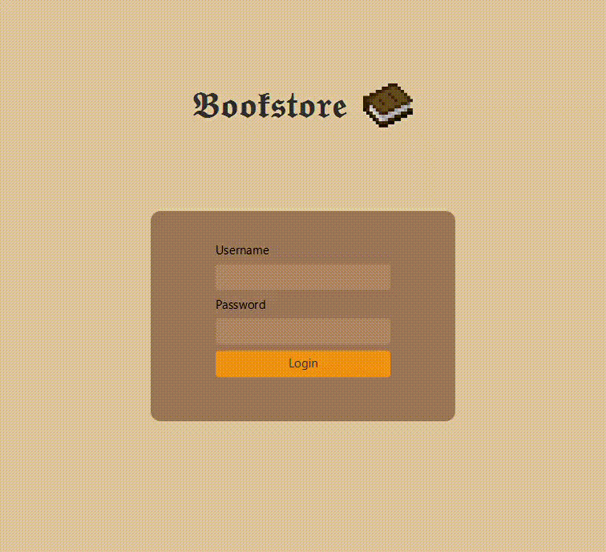

# Bookstore-App
Worked alongside a team of 4 to build a desktop application that allows users to purchase books, and enables administrators to update and track book inventory while also having access to a customer database where they can view and modify customer details.

This project was fully built in Java and used JavaFX for the GUI, OOP was utilized to create book and customer objects and the state design pattern was applied to change the member status of a customer. 

  

